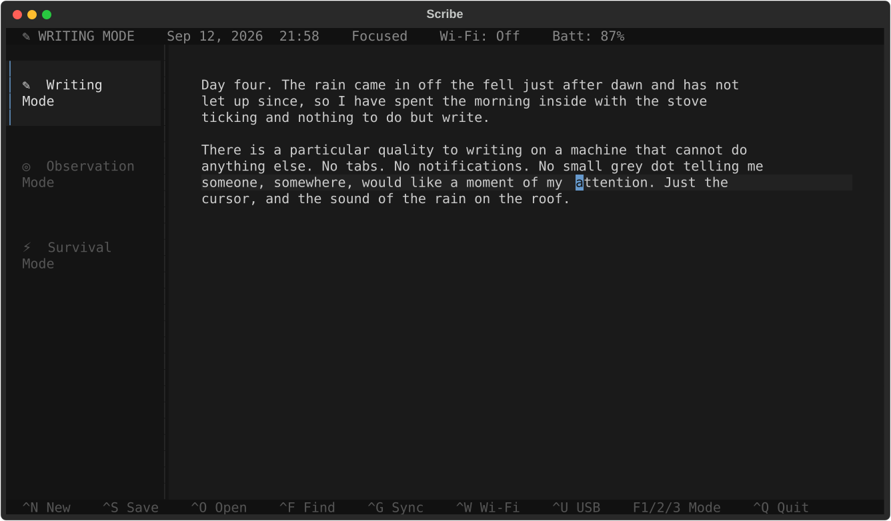
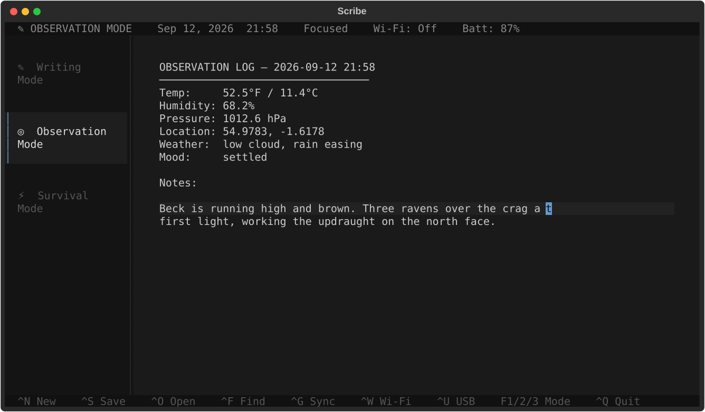
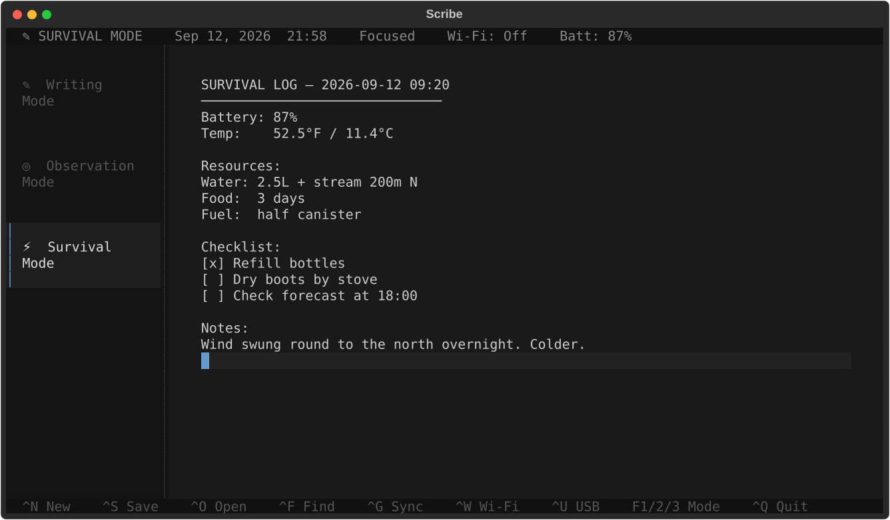
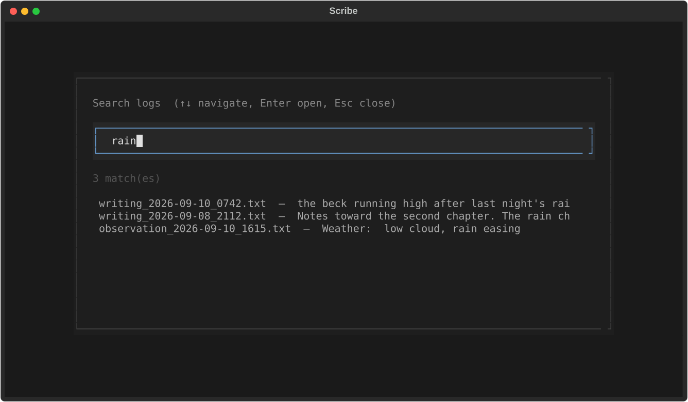

# Writerdeck

A low-power, distraction-free writing and logging setup for Raspberry Pi Zero 2W.

Built with [Textual](https://textual.textualize.io/) — runs in any terminal.



## Setup

```bash
pip install textual
python3 scribe.py
```

Or use the installer (handles boot auto-launch):

```bash
./install.sh
```

## Keyboard shortcuts

| Key | Action |
|-----|--------|
| `Ctrl+N` | New document (auto-fills sensor data in Observation/Survival mode) |
| `Ctrl+S` | Save → `~/Documents/scribe/<mode>_YYYY-MM-DD_HHMM.txt` + auto-commit |
| `Ctrl+O` | Open last saved log (mode-aware) |
| `Ctrl+F` | Full-text search across all logs |
| `Ctrl+G` | Git push — sync commits to remote over Wi-Fi |
| `Ctrl+W` | Toggle Wi-Fi on/off |
| `Ctrl+U` | USB data dump — copy all logs to detected USB drive |
| `F1/F2/F3` | Switch to Writing / Observation / Survival mode (`Ctrl+1/2/3` also works where the terminal sends it) |
| `F6` | Cycle through modes (`Ctrl+Tab` where supported) |
| `Ctrl+Q` | Quit |

## Modes

**Writing** — blank document, freeform journaling and notes. Shown in the
screenshot above.

**Observation** — structured template auto-filled with BME280 sensor data
(temp, humidity, pressure) and GPS coordinates if hardware is present.



**Survival** — battery status, temp, resource tracking (water/food/fuel),
and a checklist.



`Ctrl+F` searches the full text of every saved log, across all modes:



Screenshots are generated from the real app with
`python3 docs/screenshots/generate.py` — rerun it after UI changes.

## Data flow

```
Write → Save (TXT) → Git auto-commit → Ctrl+G push → Remote / Syncthing
                   → Ctrl+U dump   → USB drive
```

Every `Ctrl+S` save auto-commits the file to a git repo in `~/Documents/scribe/`.
Run `Ctrl+G` when Wi-Fi is on to push commits to a configured remote.
For passive sync, install [Syncthing](https://syncthing.net/) and point it at
`~/Documents/scribe/`.

## Optional hardware (Raspberry Pi)

### BME280 (temperature, humidity, pressure)

```bash
sudo apt install python3-smbus
pip install smbus2 RPi.bme280
```

Connects via I2C at address `0x76`. Enable I2C with `sudo raspi-config`.

### GPS (u-blox NEO-6M)

```bash
sudo apt install gpsd gpsd-clients
pip install gpsd-py3
# Point gpsd at your serial device, e.g.:
sudo gpsd /dev/ttyAMA0 -F /var/run/gpsd.sock
```

### Wi-Fi toggle

`Ctrl+W` uses `rfkill` on Linux. Ensure it is installed:

```bash
sudo apt install rfkill
```

## Git sync setup

```bash
cd ~/Documents/scribe
git remote add origin <your-remote-url>
```

After adding a remote, `Ctrl+G` will push all local commits.

## Roadmap

- [x] Writing / Observation / Survival modes
- [x] Auto-timestamped plain-text logs
- [x] Full-text search
- [x] Git auto-commit on save
- [x] Git push sync (Ctrl+G)
- [x] Wi-Fi toggle (Ctrl+W)
- [x] USB data dump (Ctrl+U)
- [x] BME280 sensor integration
- [x] GPS integration via gpsd
- [ ] E-ink display support (Waveshare 7.5" SPI)
- [ ] Power Management HAT battery reading
